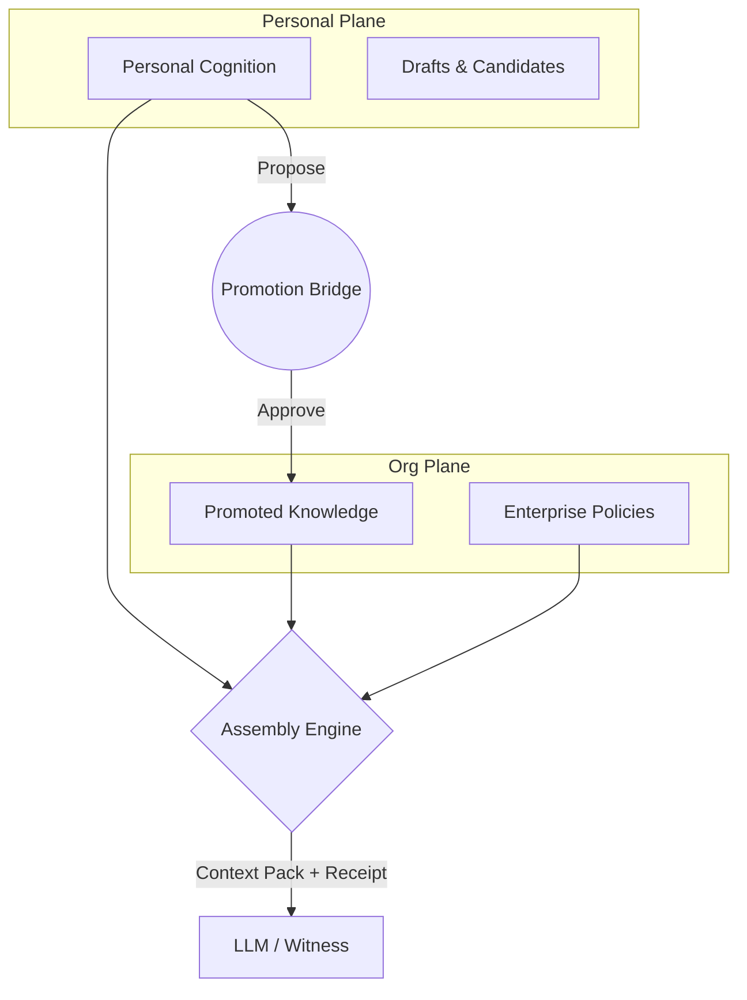

# Unified Brain (VelEntRun)

## Executive Summary
Unified Brain is a constitutional context operating system. It acts as an intelligent intermediary between an organization's raw data and its AI agents. Instead of giving AI unfiltered access to everything, Unified Brain dynamically assembles the highest-quality context that can *legitimately* participate in an AI reasoning act, for a given principal, under explicit governance.

## The Problem
Every AI interaction today begins from an information vacuum. To fix this, organizations dump years of accumulated context into vector databases or retrieval-augmented generation (RAG) systems. The hard problem is not *retrieving* that context—it is **legitimacy**: deciding what context may lawfully participate in a given act of reasoning, for a given principal, at a given moment.

## The Core Insight
The problem is **context deficiency, not memory**. Fixing it requires a constitutional approach to data, not a surveillance approach. Unified Brain solves context deficiency without solving it by surveillance.

## Architecture Diagram


## Current Features
- **Federated Planes:** Cryptographic/logical separation of personal cognition and organizational knowledge.
- **The Promotion Bridge:** Explicit, reviewed governance acts that transition personal cognition into organizational memory.
- **Context Assembly Engine:** Computes authorization *before* retrieval. No filtering of over-authorized data because retrieval is bounded by registered query templates.
- **Explainability Receipts:** Cryptographic proof of why every piece of context was included in an LLM reasoning act.
- **Strict Authentication:** Platform-issued JWT identity with deny-by-default route security and robust role-based access control (ReBAC).

## Quick Start

### 1. Prerequisites
- Node.js (v18+)
- A Neo4j Database (Aura DB or local `docker compose up -d`)
- OpenAI API Key

### 2. Run the Stack
```bash
# Terminal 1: Start Backend (http://localhost:3000)
cd backend
npm install
npm run dev

# Terminal 2: Start Frontend (http://localhost:5173)
cd frontend
npm install
npm run dev
```
*Note: The backend requires `NEO4J_URI`, `NEO4J_USER`, `NEO4J_PASSWORD`, and `OPENAI_API_KEY` in `backend/.env`.*

## Repository Structure

```text
├── backend/          # Express/TypeScript assembly engine & API
├── frontend/         # React/Vite Enterprise Admin Console & User Workspace
├── docs/             # Comprehensive documentation layers (see below)
```

## Documentation Map

Unified Brain is documented in 7 distinct layers. Start here:

| Document | Purpose |
|----------|---------|
| [ARCHITECTURE.md](docs/ARCHITECTURE.md) | **How does it work?** The pure engineering design (Neo4j, Context Assembly, LLM integrations). |
| [IMPLEMENTATION_GUIDE.md](docs/IMPLEMENTATION_GUIDE.md) | **How do I build it?** Local setup, environment variables, testing, and deployment. |
| [CONSTITUTION.md](docs/CONSTITUTION.md) | **Why is it designed this way?** The foundational product philosophy. |
| [PROJECT_STATE.md](docs/PROJECT_STATE.md) | **Where are we today?** The engineering journal, current milestone, and technical debt. |
| [ROADMAP.md](docs/ROADMAP.md) | **Where are we going?** Short-term and long-term milestones. |
| [HISTORY.md](docs/HISTORY.md) | **How did we get here?** Evolution, architectural reviews, and repository hardening. |
| [design-history/](docs/design-history/) | **Engineering Archaeology.** The original interviews and decisions that shaped the project. |
