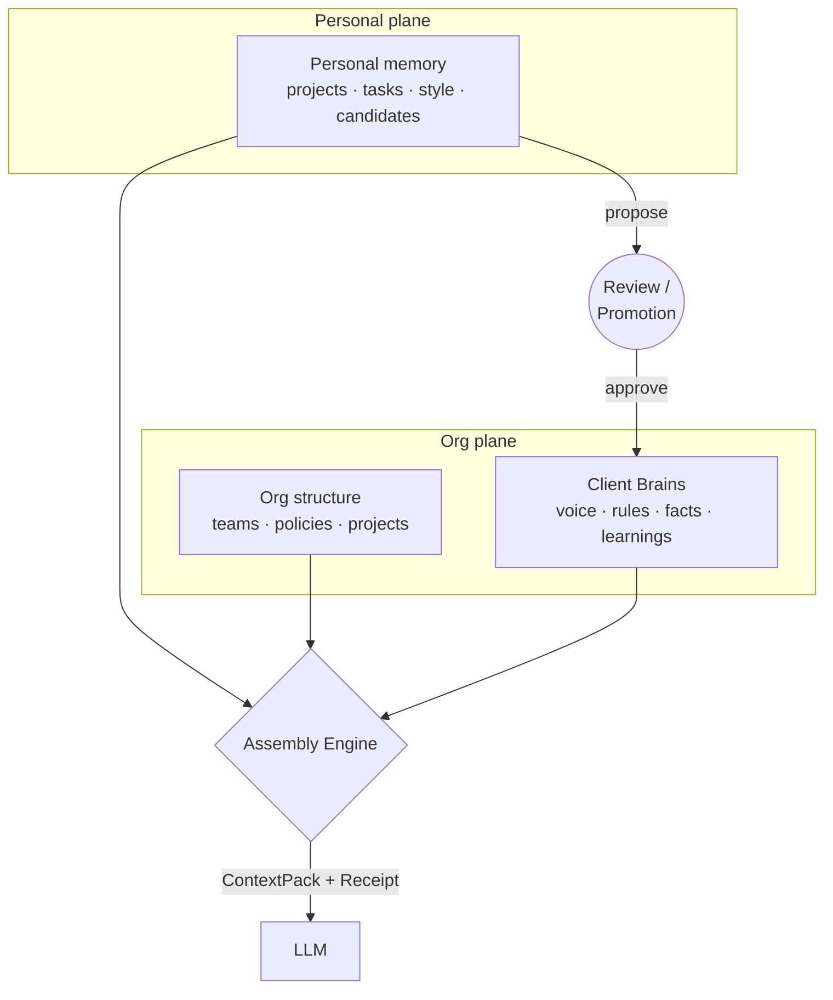

# Unified Brain

**A context assembly engine for organizations** — Unified Brain sits between an
organization's accumulated knowledge and its AI reasoning, and answers one question
per request: *given this authenticated principal, what is the highest-quality
context that can legitimately participate in reasoning?* Every answer ships with a
receipt proving what entered and what boundary held.

## The problem

Every AI interaction starts from an information vacuum, while the humans and
organizations behind it hold years of context — projects, policies, brand rules,
relationships, past decisions. The industry's default fix is indiscriminate
retrieval: index everything, inject what seems useful. The hard problem is not
retrieval; it is **legitimacy** — deciding what context *may* participate, for whom,
under which rules, and being able to prove it afterwards. Unified Brain solves
context deficiency without solving it by surveillance.

## Architecture at a glance



Express/TypeScript assembly engine · Neo4j knowledge graph · React/Vite console ·
OpenAI generation layer. Full detail: [docs/ARCHITECTURE.md](docs/ARCHITECTURE.md).

## Key concepts

| Concept | What it is |
|---------|------------|
| **ContextPack** | The structured, pre-authorized context for one reasoning act. Assembly enforces authorization at query construction — nothing unauthorized is ever materialized, so nothing needs filtering. [→ docs](docs/CONTEXT_PACK.md) |
| **ExplainabilityReceipt** | Attached to every result: exactly which knowledge entered, why, and an assertion of the isolation boundary that held. Approvals only — denials are never leaked into user-visible output. [→ docs](docs/EXPLAINABILITY_RECEIPT.md) |
| **Client Brain** | The V1 product core: per-client-account knowledge (brand voice, hard rules, facts, learnings) with **client walls** — assembly is bound to exactly one client per request, by query construction. Built for agencies serving competing clients. |
| **Personal Brain** | Individual memory (projects, tasks, style, LLM-extracted candidates), ownership-bound and structurally unreachable from organizational endpoints. |
| **Enterprise Brain** | The organizational plane: teams, policies, org projects, and the admin console that manages them. Policies are force-included into assembly — mandatory context bypasses ranking. |
| **Trust Queue / Promotion** | Knowledge becomes shared only through propose → review → approve. Rejections are purged, approvals are audited (`PromotionEvent`). Promotion, not discovery. |
| **Knowledge graph** | Neo4j schema with memory-bearing edges (`usageCount`, `lastUsed`, `memoryState`) that reinforce with use and decay without it. [→ schema reference](docs/KNOWLEDGE_GRAPH.md) |

## Quick start

**Prerequisites:** Node 20+, a Neo4j instance (Aura, or local via `docker compose up -d`),
an OpenAI API key.

```bash
# 1. Configure
#    backend/.env  →  NEO4J_URI, NEO4J_USER, NEO4J_PASSWORD, OPENAI_API_KEY

# 2. Backend (terminal 1) — http://localhost:3000
cd backend && npm install && npm run dev

# 3. Frontend (terminal 2) — http://localhost:5173
cd frontend && npm install && npm run dev
```

First-time database setup (⚠️ **wipes the database** — the script refuses non-empty
databases unless `SEED_ALLOW_WIPE=true`):

```bash
cd backend && npm run seed
```

Integration test for the memory engine (backend must be running):

```bash
cd backend && npx tsx test-engine.ts
```

Full developer guide (env vars, auth flows, troubleshooting):
[docs/IMPLEMENTATION_GUIDE.md](docs/IMPLEMENTATION_GUIDE.md).

## Deployment

Two Vercel projects (frontend + backend), auto-deployed on push to `master`.
Production requires `JWT_SECRET` and `ADMIN_PRINCIPALS` (the server fails closed
without them), and env changes need a redeploy — frontend `VITE_*` values are baked
in at build time. Details and the troubleshooting table:
[docs/IMPLEMENTATION_GUIDE.md](docs/IMPLEMENTATION_GUIDE.md#deployment).

## Repository structure

```text
├── backend/          # Assembly engine: auth, planes, client brain, extraction, graph service
├── frontend/         # React console: workspace, enterprise console, Google sign-in
├── docs/             # Documentation (map below)
├── neo4j-init.cypher # Graph schema + demo seed (destructive; guarded)
└── docker-compose.yml# Local Neo4j
```

## Documentation map

| Document | Question it answers |
|----------|--------------------|
| [ARCHITECTURE.md](docs/ARCHITECTURE.md) | How does it work — implemented vs. designed, explicitly separated |
| [KNOWLEDGE_GRAPH.md](docs/KNOWLEDGE_GRAPH.md) | The full Neo4j schema: nodes, edges, memory model, wall mechanics |
| [AUTHORIZATION.md](docs/AUTHORIZATION.md) | What is enforced today, precisely — and what is future work |
| [SECURITY.md](docs/SECURITY.md) | Threat model, derogation register, incident history |
| [CONTEXT_PACK.md](docs/CONTEXT_PACK.md) · [EXPLAINABILITY_RECEIPT.md](docs/EXPLAINABILITY_RECEIPT.md) | The two output contracts |
| [DESIGN_DECISIONS.md](docs/DESIGN_DECISIONS.md) | The load-bearing decisions and what they cost |
| [CONSTITUTION.md](docs/CONSTITUTION.md) | The product philosophy the architecture derives from |
| [IMPLEMENTATION_GUIDE.md](docs/IMPLEMENTATION_GUIDE.md) | Local development, env vars, deployment, troubleshooting |
| [PROJECT_STATE.md](docs/PROJECT_STATE.md) · [ROADMAP.md](docs/ROADMAP.md) · [HISTORY.md](docs/HISTORY.md) | Where the project is, where it's going, how it got here |
| [design-history/](docs/design-history/) | Engineering archaeology: original brief, early specs, validation dry-runs, the constitutional derivation |

## Status & known limitations

This is a pre-launch system being hardened for a first design-partner deployment.
Honesty policy: gaps are documented, not hidden.

- **Working today:** Google Sign-In; JWT-gated API with fail-closed admin controls;
  Client Brain lifecycle end-to-end (document upload → extraction → review →
  client-walled assembly → generation with receipt); the original personal memory
  engine with reinforcement/decay.
- **Known limitations:** ranking is lexical (embeddings retrieval is the next
  milestone); a dev login scaffold remains enabled in production behind an env flag
  until the console moves to Google-only auth; both planes share one Neo4j instance
  (logical separation); org-level roles and the formal template-registry/PDP layer
  are designed but not built. The full register with exit paths:
  [SECURITY.md](docs/SECURITY.md) §3.
- **Roadmap:** [docs/ROADMAP.md](docs/ROADMAP.md).

## License

Proprietary — all rights reserved. Shared for technical evaluation; see [LICENSE](LICENSE).
