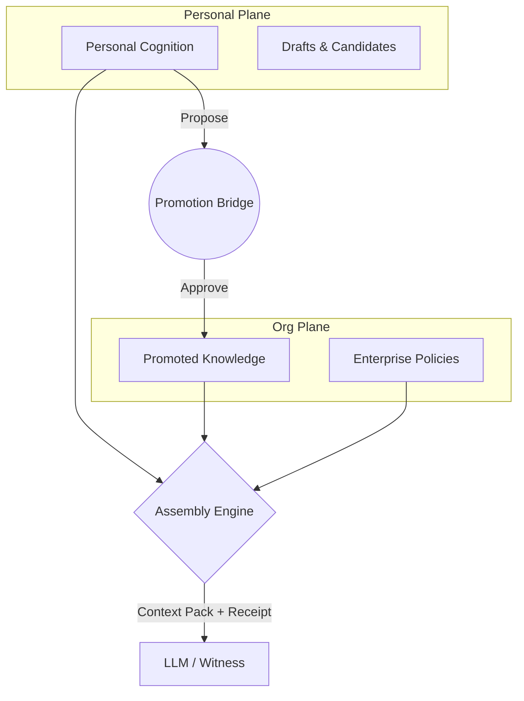

# Unified Brain — System Architecture

This document describes the pure engineering architecture of the Unified Brain context operating system.

## 1. System Overview

Unified Brain operates as an assembly engine between an organization's raw data and its LLM reasoning interfaces. It strictly separates data into two distinct cryptographic/logical boundaries:

## 2. Federated Planes

The graph is not one single entity. It is a federation of planes connected by governed bridges.

### 2.1 The Personal Plane
The personal plane holds individual cognition, drafts, candidate memories, and personal tasks. 
- **Schema Key:** All nodes carry an `ownerId`.
- **Visibility:** Structurally invisible to all organizational endpoints. The Assembly Engine must explicitly bind `ownerId = $principalId` to access it.

### 2.2 The Organizational Plane
The org plane holds promoted KnowledgeObjects, policies, projects, teams, memberships, and audit events.
- **Schema Key:** Nodes are owned by an `Organization`.
- **Visibility:** Read-access is granted via Role-Based Access Control (ReBAC) evaluated by the Policy Decision Point (PDP).

## 3. The Promotion Bridge (Trust Layer)

The only way data moves from the Personal Plane to the Org Plane is across the Promotion Bridge.
1. **Propose:** The owner initiates a `PromotionProposal` containing a snapshot of their cognition.
2. **Review:** A reviewer (via the Enterprise Console) inspects the proposal.
3. **Approve/Reject:** If approved, a new `KnowledgeObject` is created in the Org Plane with a cryptographic provenance hash linking back to the originator. If rejected, the proposal is purged.

## 4. Context Assembly & Authentication

Authorization is computed **before** retrieval, preventing the over-fetching of data.

### 4.1 Authentication
- Unified Brain uses platform-issued JSON Web Tokens (JWT).
- The `principalId` is strictly extracted from the validated token.
- Caller-asserted `userId` parameters in the body or URL are strictly forbidden and result in a 403 Forbidden.

### 4.2 Policy Decision Point (PDP) & Templates
1. An incoming request provides a `ReasoningDeclaration` (beneficiary, purpose, and declared witnesses).
2. The in-process PDP evaluates the principal's organizational memberships and roles.
3. The PDP generates a list of **Authorized Templates** with fully bound parameters (e.g., `MATCH (n:Policy {orgId: $boundOrgId})`).
4. The Assembly Engine executes these exact templates against Neo4j. It cannot alter the query shape.

## 5. Neo4j Graph Database
The data store is Neo4j (Aura DB in production, Docker locally). 
Currently, both planes map to a single physical Neo4j instance, logically partitioned by `ownerId` and `orgId`. The application logic (in `backend/src/planes.ts`) abstracts this, allowing future deployments to split the planes into entirely separate databases by simply changing connection strings.

## 6. The Assembly Engine & LLM (Witness)
The backend (Express/TypeScript) acts as the Assembly Engine.
- **Context Pack:** The retrieved, pre-authorized data is structured into a `ContextPack`.
- **Explainability Receipt:** Every item in the Context Pack receives a receipt entry containing its `authorizationDecisionId`, proving *why* it was included.
- **Execution:** The Context Pack is injected into the LLM (the declared witness) to execute the reasoning act. 

## 7. Future Connectors
Unified Brain is designed for N-plane federation. Future connectors will allow:
- **Shared Project Planes:** Cross-tenant collaboration spaces.
- **Agent Beneficiaries:** Autonomous agents consuming context under delegated (but highly constrained) authorization.
- **Physical Plane Separation:** Spinning up isolated databases per tenant without code changes.
