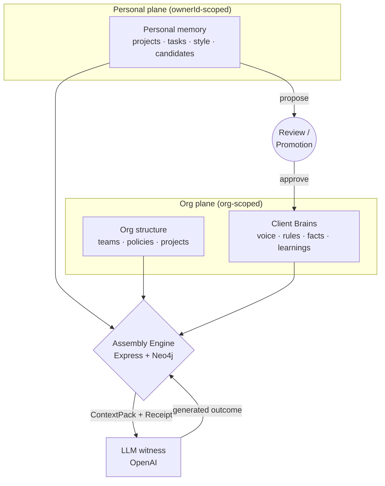

# Unified Brain — System Architecture

This document describes the engineering architecture of Unified Brain. It is explicit
about what is **implemented today** versus what is **designed but not yet built** —
the destination architecture lives in [CONSTITUTION.md](CONSTITUTION.md) and the
decision record in [DESIGN_DECISIONS.md](DESIGN_DECISIONS.md).

## 1. System overview

Unified Brain is a context assembly engine that sits between an organization's
accumulated knowledge and LLM reasoning. Its core responsibility: for a given
authenticated principal and request, assemble the highest-quality context that can
*legitimately* participate in reasoning — then prove it, via an explainability
receipt attached to every result.

Two assembly paths exist today:

| Path | Anchor | Endpoint | Status |
|------|--------|----------|--------|
| **Client Brain** (V1 product) | The client account | `POST /api/clients/:id/enhance` | Implemented, tested |
| **Personal memory engine** (original engine) | The employee | `POST /api/enhance` | Implemented; being superseded by the Client Brain surface |

## 2. Planes: separation of authority

The graph is treated as a federation of authority domains ("planes"), not one
undifferentiated database.

- **Personal plane** — individual memory: projects, tasks, style, LLM-extracted
  candidates. Every node carries `ownerId`; every query that touches it binds
  `ownerId = $principalId`.
- **Org plane** — organizations, teams, memberships, policies, org projects,
  promoted artifacts, and **Client Brains** (per-client-account knowledge).

**Implemented today:** planes are a *logical* separation enforced at the query
layer. `backend/src/planes.ts` gives each plane its own driver/session factory and
environment-mapped connection config; both currently point at one Neo4j instance
(documented as Derogation D1 in [SECURITY.md](SECURITY.md)). Splitting planes onto
separate databases is a configuration change, not a code change — that was the
design intent of the abstraction.

**Not yet implemented:** cryptographic enforcement (owner-held keys), physical
separation, per-plane infrastructure.

## 3. The Client Brain (V1 product core)

The unit of value for the first market (marketing agencies) is the **client
account**. Each client gets an isolated knowledge domain:

- `ClientKnowledge` items of four kinds: `voice` (brand voice), `rule` (hard
  constraints), `fact` (durable client facts), `learning` (evidence from past work).
- **Client walls:** every Client Brain query resolves the client *through the
  caller's own org membership* (`User→MEMBER_OF→Team→BELONGS_TO→Org→HAS_CLIENT→Client`).
  A client outside the caller's org returns 403. No query shape can span two
  clients — cross-client assembly is inexpressible, not filtered.
- **Assembly semantics:** `voice` and `rule` items are always included (generation
  without them is what makes AI output generic); `fact` and `learning` items are
  ranked against the request. Usage reinforces items (`usageCount`, `lastUsed`),
  enabling staleness detection later.

See [KNOWLEDGE_GRAPH.md](KNOWLEDGE_GRAPH.md) for the full schema and
[CONTEXT_PACK.md](CONTEXT_PACK.md) / [EXPLAINABILITY_RECEIPT.md](EXPLAINABILITY_RECEIPT.md)
for the payload contracts.

## 4. Knowledge lifecycle: propose → review → active

Knowledge never becomes shared by existing — it is **promoted** through review:

1. **Ingestion** — a document (PDF/DOCX/TXT/MD upload, or raw text) is parsed
   (`fileParsing.ts`) and run through the extraction engine (`extraction.ts`),
   which produces structured candidates with kind, title, content, confidence
   (≥70 floor), and a verbatim evidence quote. The extraction prompt is engineered
   against the generic-filler failure mode: items that could apply to any brand
   are discarded.
2. **Review** — candidates land in a per-client review queue with status
   `proposed`. A reviewer approves (item becomes `active`, optionally edited) or
   rejects (**the item is purged** — rejected content is never retained).
3. **Audit** — every review decision writes a `PromotionEvent` (who, what, when).

The same pattern exists in the original engine as the artifact **Trust Queue**
(`Proposed` artifacts reviewed org-wide).

## 5. Identity and authorization

Implemented today (see [AUTHORIZATION.md](AUTHORIZATION.md) for detail and roadmap):

- **Google Sign-In** (`POST /api/auth/google`) — verified identity via Google ID
  token; the real login path.
- **Platform JWT** — every `/api` route (except health/login) requires a bearer
  token; identity comes *only* from the token. Route-parameter identity mismatches
  return 403.
- **Dev login** — an identity-asserted scaffold, disabled in production unless
  explicitly enabled (`ALLOW_DEV_LOGIN`); scheduled for removal when the Client
  Room UI ships Google-only.
- **Admin gate** — deny-by-default allowlist (`ADMIN_PRINCIPALS`) on all
  org-management routes; the graph-wipe endpoint is additionally disabled outright
  in production.
- **Query discipline** — all graph access uses fixed-shape, parameter-bound
  queries. There is no dynamic Cypher construction and no unbounded variable-length
  traversal in any authorized path.

**Designed, not yet built:** the formal template registry with CI linting, an
in-process Policy Decision Point issuing per-request authorization decisions, and
org-level roles (reviewer, governance author). These are specified in
[CLIENT_BRAIN_V1.md](CLIENT_BRAIN_V1.md) and [PROJECT_STATE.md](PROJECT_STATE.md).

## 6. Data store

Neo4j (Aura in production, Docker locally). Both planes currently share one
instance, partitioned by `ownerId`/org scoping (Derogation D1). All persisted
objects created since M0 carry `constitutionVersion`, enabling future migration
and constitutional versioning.

## 7. LLM layer

`llmService.ts` wraps providers behind a small interface (`AIProvider`), with
OpenAI as primary and a mock fallback. Three model roles, independently
configurable by env: generation (`GENERATION_MODEL`), extraction
(`EXTRACTION_MODEL`), and the legacy enhance path (default `gpt-4o-mini`).
The LLM is a **declared witness** in the constitutional model — context sent to it
is part of the trust boundary, documented honestly as Derogation D3.

## 8. Destination architecture (design, not implementation)

For reviewers interested in where this is deliberately headed:
**federated constitutional planes** — N sovereign authority domains (personal,
org, shared-project, agent) connected only by governed bridges, with authorization
computed before retrieval as registered templates, receipts carrying authorization
decision IDs, and witness minimization over time. The full derivation is in
[CONSTITUTION.md](CONSTITUTION.md) and
[design-history/Constitution-Derivation.md](design-history/Constitution-Derivation.md).
Nothing in the current implementation contradicts it; the abstractions
(`planes.ts`, fixed templates, promotion lifecycle, receipts) exist so that each
hardening step is a migration, not a rewrite.
