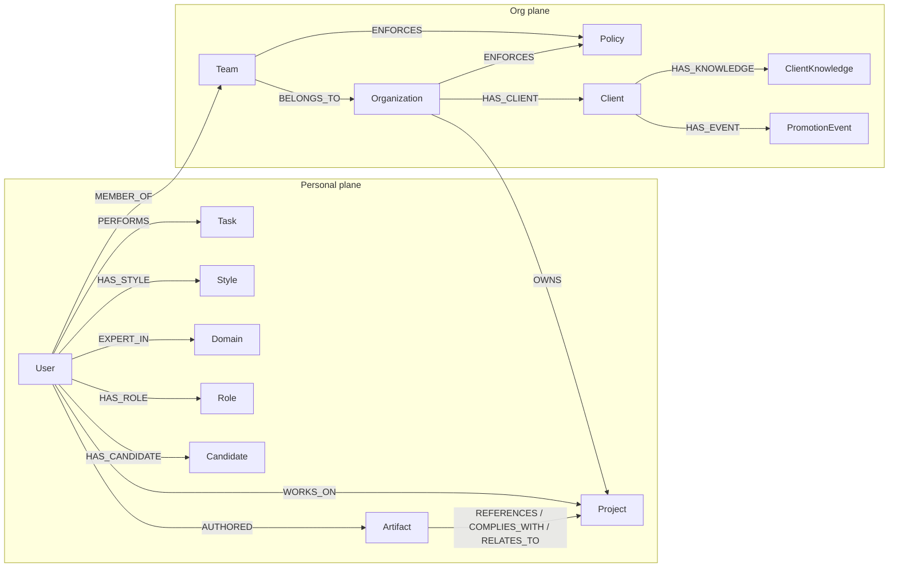

# Knowledge Graph — Schema Reference

The complete Neo4j schema as implemented. Two authority domains (planes) share one
instance today, partitioned by ownership keys (see [ARCHITECTURE.md](ARCHITECTURE.md) §2).

## 1. Overview

## 2. Node labels

### Personal plane

| Label | Key properties | Notes |
|-------|---------------|-------|
| `User` | `id`, `name`, `email?`, `authProvider?`, `lastLogin?` | Principal anchor. Google-authenticated users get `id = 'g-' + sub` |
| `Project` | `id`, `name`, `type` | Personal projects (`type: 'Personal'`); org projects reached via `OWNS` |
| `Task` | `id`, `name` | |
| `Style` | `id`, `formattingRules` | Communication style injected into generation |
| `Domain` | `id`, `name` | Expertise areas |
| `Role` | `id`, `name` | Persona descriptor (job title) — **not** an authorization role |
| `Candidate` | `id`, `type`, `name`, `confidence`, `reinforcementCount`, `firstSeen`, `lastSeen`, `ownerId`, `constitutionVersion` | LLM-extracted from prompts; promoted to real memory by the owner |
| `Artifact` | `id`, `type`, `prompt`, `outcome`, `knowledgeSummary`, `timestamp`, `weight`, `confidence`, `status`, `source`, `authority`, provenance fields (`generationModel`, `brainVersion`, `contextPackVersion`, `policyVersion`, `promptHash`, `retrievalConfidence`), `ownerId`, `constitutionVersion` | Generated outcomes with provenance. `status: Proposed → Validated` via the Trust Queue |

### Org plane

| Label | Key properties | Notes |
|-------|---------------|-------|
| `Organization` | `id`, `name` | Tenant anchor |
| `Team` | `id`, `name` | |
| `Policy` | `id`, `ruleText` | Mandatory constraints, force-included in legacy assembly |
| `Client` | `id`, `name`, `industry`, `status`, `createdAt`, `createdBy`, `constitutionVersion` | **V1 anchor entity** — a client account of the agency |
| `ClientKnowledge` | `id`, `kind`, `title`, `content`, `status`, `source`, `confidence`, `evidence`, `proposedBy/At`, `reviewedBy/At`, `usageCount`, `lastUsed`, `constitutionVersion` | `kind ∈ {voice, rule, fact, learning}`, `status ∈ {proposed, active}`. Rejected items are deleted, never retained |
| `PromotionEvent` | `id`, `knowledgeId`, `action`, `reviewerId`, `timestamp`, `constitutionVersion` | Immutable review audit trail |
| `Template` | `id`, … | Present in the seed schema for future templated generation; no active code path yet |

## 3. Relationships

| Relationship | From → To | Edge properties | Notes |
|--------------|-----------|-----------------|-------|
| `WORKS_ON` | User → Project | `memoryState`, `usageCount`, `lastUsed` | Memory-bearing edge |
| `PERFORMS` | User → Task | same | Memory-bearing edge |
| `HAS_STYLE` | User → Style | same | Memory-bearing edge |
| `EXPERT_IN` | User → Domain | — | |
| `HAS_ROLE` | User → Role | — | |
| `HAS_CANDIDATE` | User → Candidate | — | Owner-scoped only |
| `AUTHORED` | User → Artifact | `usageCount`, `lastUsed` | |
| `MEMBER_OF` | User → Team | — | The org-membership wall anchor |
| `BELONGS_TO` | Team → Organization | — | |
| `ENFORCES` | Team/Org → Policy | `memoryState`, `usageCount`, `lastUsed` | Policies are always force-included |
| `OWNS` | Organization → Project | — | |
| `HAS_CLIENT` | Organization → Client | — | The client wall anchor |
| `HAS_KNOWLEDGE` | Client → ClientKnowledge | — | |
| `HAS_EVENT` | Client → PromotionEvent | — | |
| `REFERENCES` / `COMPLIES_WITH` / `RELATES_TO` | Artifact → context nodes | — | Provenance links from generated artifacts back to the context that produced them |

## 4. Memory evolution model

Memory-bearing edges carry a lifecycle driven by usage:

- `memoryState`: `Active` → `Recent` (>7 days unused) → `Archived` (>30 days unused)
- Assembly *reinforces*: items selected into a ContextPack get `usageCount + 1` and a
  fresh `lastUsed`; archived items that match a request strongly can reactivate.
- `POST /api/simulate-time` exists to demonstrate decay without waiting real days.

`ClientKnowledge` uses the same reinforcement fields (`usageCount`, `lastUsed`),
enabling stale-guideline detection ("this rule hasn't been used since the client
rebranded") as a planned surface.

## 5. Query discipline (the wall mechanics)

Two invariants, enforced by construction in every query in
`graphService.ts` / `clientBrain.ts`:

1. **Ownership binding** — any query touching the personal plane binds
   `ownerId`/`{id: $userId}` at the anchor; any Client Brain query resolves the
   client through the *caller's* membership chain:
   `(u:User {id: $principalId})-[:MEMBER_OF]->(:Team)-[:BELONGS_TO]->(o:Organization)-[:HAS_CLIENT]->(c:Client {id: $clientId})`.
   Zero rows means 403 — deny is the default.
2. **Fixed shapes only** — no dynamically constructed Cypher, no unbounded
   variable-length expansion. The graph-visualization endpoint uses a UNION of six
   directed, fixed-depth paths precisely because its earlier undirected `[*0..3]`
   form leaked colleagues' subgraphs through shared hub nodes (see
   [SECURITY.md](SECURITY.md)).

## 6. Constraints

Uniqueness constraints exist on `id` for: User, Organization, Team, Project,
Policy, Style, Role, Domain, Task, Template (created by `neo4j-init.cypher`).
`Client` and `ClientKnowledge` ids are generated with collision-resistant
timestamps + randomness; formal constraints for them ship with the next schema
migration.
